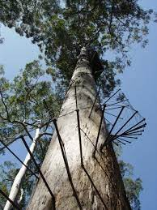

# karri
A devop tool which will execute a sequence of steps. When re-run it 
remembers which steps have already run and skips them. It will update or rollback steps  as requested.

# Background
This tool is inspired by Liquibase which is a popular tool for managing schema changes in SQL databases. 

# The Name
There is a giant tree in Western Australia called the [Gloucester Tree](https://en.wikipedia.org/wiki/Gloucester_Tree). It's 190 feet tall and has a ladder made of steel sikes to the top.  Each rung in the ladder is like steps in a sequence. The tree is of species Karri (Eucalyptus diversicolor). 

The default branch for this repository is `trunk`, naturally.
